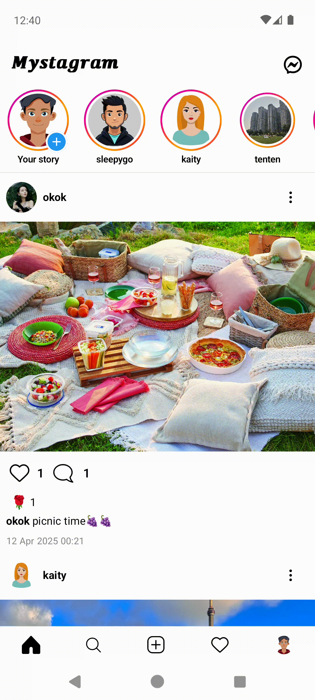
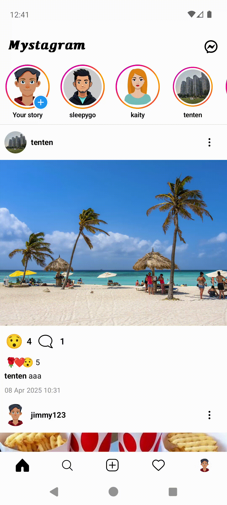
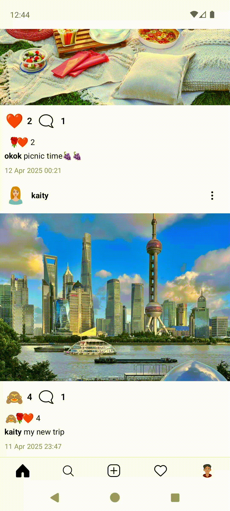
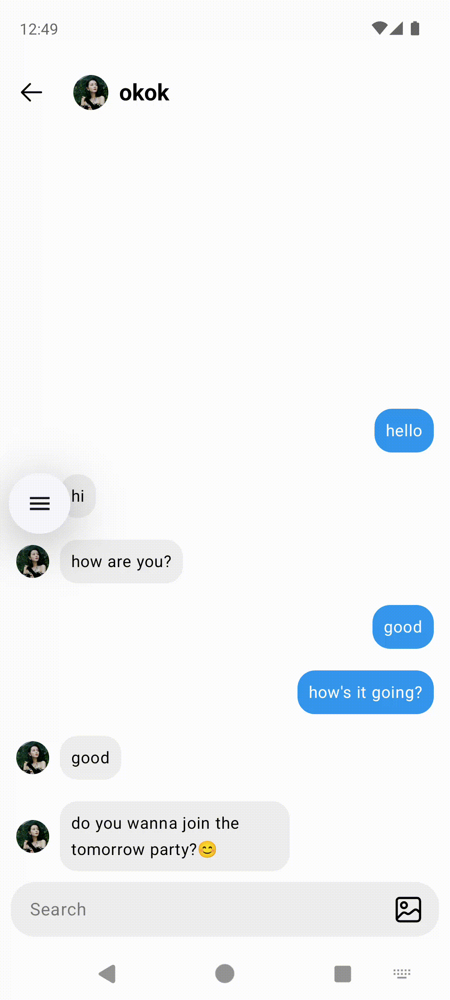
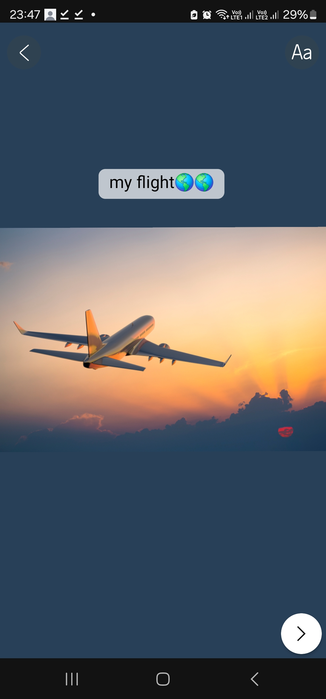

# Mystagram

Mystagram is an Instagram clone app built with [Jetpack Compose][compose] and Material3.

Some of the core features:
* Home Screen
* Post Reaction and Comment
* Story View
* Story Creation with Text and Main Palette
* Real-time Chat Box with Push Notifications

  
  
  
  
  
  

Mystagram is still under development.
