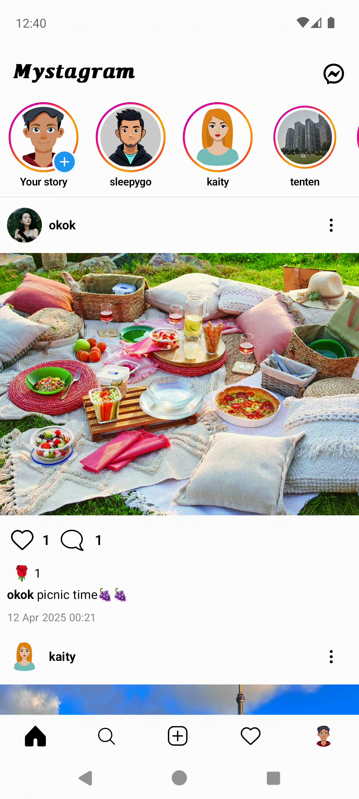
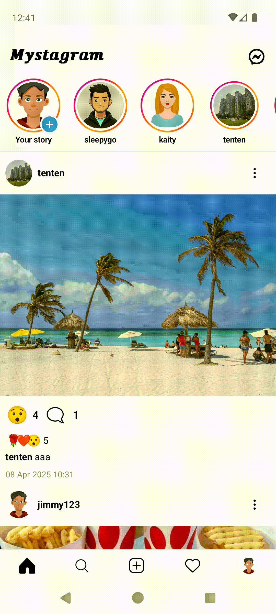
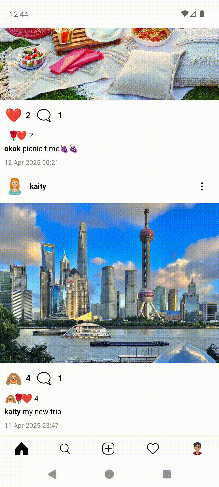
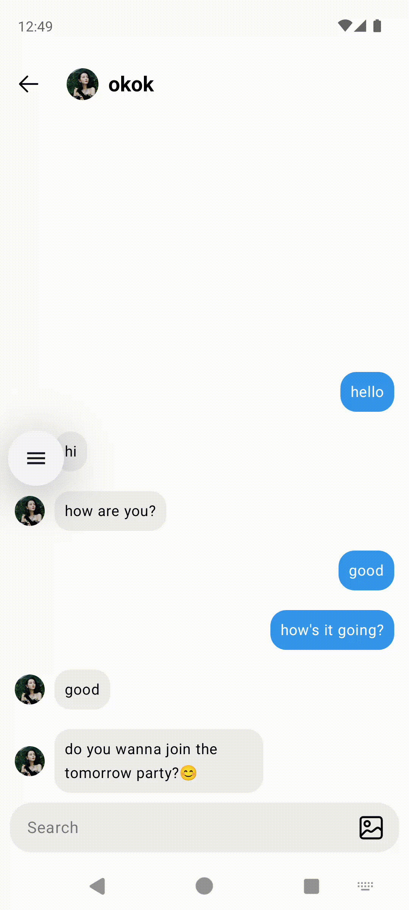
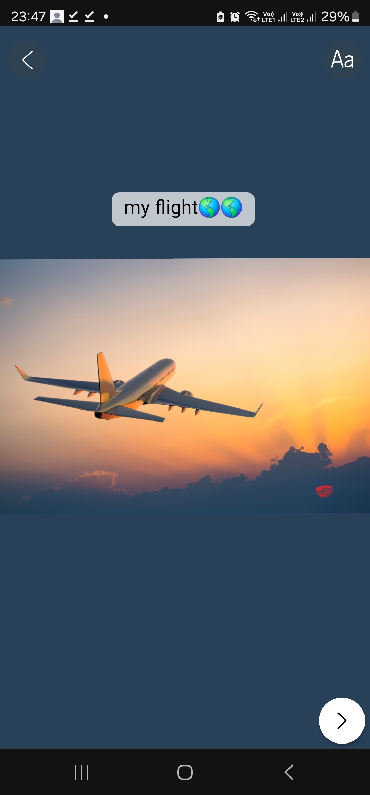
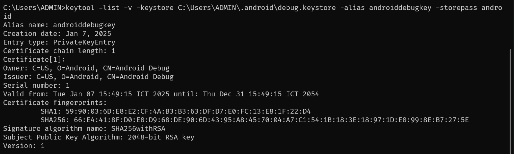
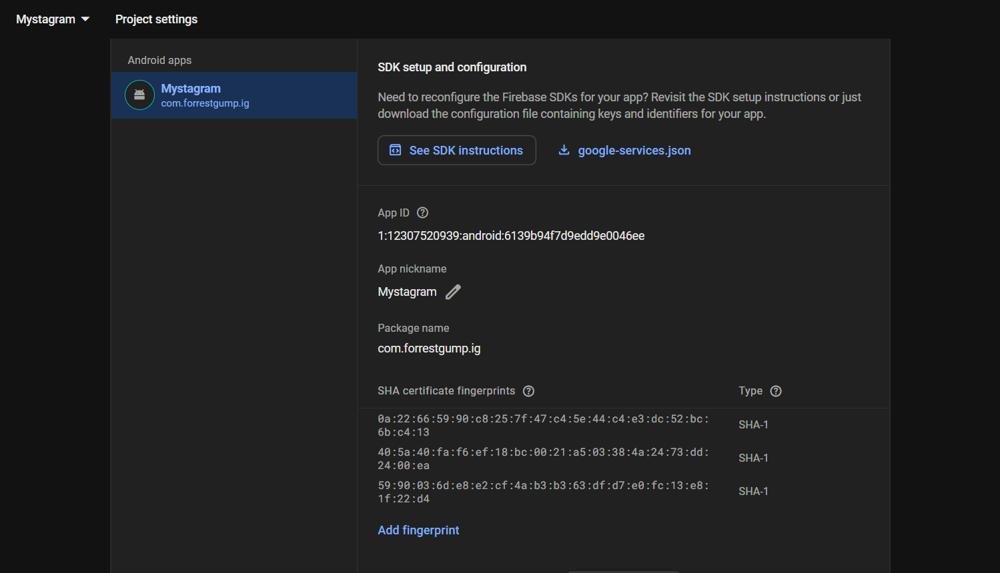

# Mystagram

Mystagram is an Instagram clone app built with [Jetpack Compose][compose] and Material3.

Some of the core features:
* Home Screen
* Post Reaction and Comment
* Story View
* Story Creation with Text and Main Palette
* Real-time Chat Box with Push Notifications

  
  
  
  
  
  

Note: 
1. To use the function of OAuth **login with Google** using firebase, you need to create an SHA1 key in the dir: **\.android\debug.keystore** 
by using this command line on Windows: **keytool -list -v -keystore <path\to\your\debug.keystore> -alias androiddebugkey -storepass android**
So normally the path to your debug.keystore would be something like:  **C:\Users\ADMIN\.android\debug.keystore**

  

2. Then on your project firebase, go to **Project settings** >> **Android apps** >> **Add fingerprint** >> Thêm phần SHA1 key lúc nãy tạo ra vào trong này:

  

3. Chạy lại app để thấy kết quả.
Mystagram is still under development.
